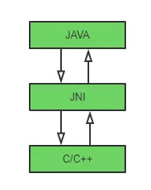

#### JNI (Java Native Interface)



[参考](https://blog.csdn.net/Easyhood/article/details/129770385)
-------------------

#### NDK (Native Development Kit)
Android NDK是一组允许您将C/C++嵌入到Android应用程序中的工具，NDK描述的是工具集。
能够在Android应用中使用原生代码的多项操作。

#### JNI方法注册

###### 静态注册

当Java层调用native函数，会在JNI库中根据函数名查找对应的JNI函数。如果没找到，会报错。
如果找到了，则会在native函数与JNI函数之间建立关联关系。

JNI函数名格式
Java_包名_类名_函数名
extern "C" JNIEXPORT jstring JNICALL
Java_com_wuzh_nativelib_NativeLib_stringFromJNI(JNIEnv* env,jobject /* this */) {
    // ...
}

extern "C" 表示当做C语言处理.

静态方法的缺点:
1. 要求JNI函数必须符合JNI的命名规范
2. 名字冗长
3. 初次调用会根据函数名去搜索JNI中对应的函数，会影响执行效率
4. 需要编译所有声明了native函数的Java类，每个所生成的class文件都要用java工具生成一个头文件。

###### 动态注册

通过提供一个函数映射表，注册给Java虚拟机，这样JVM就可以用函数映射表来调用对应的函数，就不必通过函数名来查找需调用的函数。

1. Java与JNI通过JNINativeMethod的结构来建立函数映射表，在jni.h中定义，结构如下
typedef struct {
    const char* name;
    const char* signature;
    void* fnPtr;
} JNINativeMethod;

2. 创建映射表后， 调用RegisterNatives函数将映射表注册给JVM
3. 当Java层通过System.loadLibrary加载JNI库时，会在库中查JNI_OnLoad函数。可将JNI_OnLoad视为
JNI库的入口函数，需要在这里完成所有函数表映射和动态注册工作，及其它一些初始化工作。

#### 数据类型转换

1. 基础数据类型转换

Java类型  JNI类型     描述
boolean  jboolean  无符号8位
byte     jbyte      有符号8位
char     jchar      无符号16位
short    jshort     有符号16位
int      jint       有符号32位
long     jlong      有符号64位
float    jfloat     32位
double   jdouble    64位

2. 引用数据类型转换

String    jstring   字符串
Object    jobject   引用对象

除了Class、String、Throwable和基本数据类型的数组外，其余所有Java对象的数据类型在JNI中都用jobject表示。
Java中的String也是引用类型，由于使用频率高， 在JNI中单独创建了一个jstring类型

Java引用类型            JNI类型  
All Objects           jobject
java.lang.Class       jclass
java.lang.String      jstring
java.lang.Throwable   jthrowable
Object[]              jobjectArray
boolean[]             jbooleanArray
byte[]                jbyteArray
char[]                jcharArray
short[]               jshortArray
int[]                 jintArray
long[]                jlongArray
float[]               jfloatArray
double[]              jdoubleArray

引用类型不能直接在Native层使用，需要根据JNI函数进行类型的转化后，才能使用。
多维数组都是引用类型， 需要使用jobjectArray类型存取值

```
// 获得一维数组的类引用，即jintArrayleix
jclass intArrayClass = env->FindClass("[I]");
// 构造一个指向jintArray类一维数组的对象数组，该对象数组的初始大小为length， 类型为jsize
jobiectArray objectIntArray = env->NewObjectArray(length, intArrayClass, NULL);
```

#### JNI函数签名信息

由于Java支持函数重载，因此仅仅根据函数名是没法找到对应的JNI函数。为了解决这个问题，
JNI将参数类型和返回值类型作为函数的签名信息。

1. JNI规范定义的函数签名信息格式:
(参数1类型字符...)返回值类型字符

2. 函数签名例子

Java函数              函数签名
String fun()         "()Ljava/lang/String;"
long fun(int i, Class c)    "(ILjava/lang/String;)J"
void fun(byte[] bytes)      "([B])V"

JNI常用的数据类型及对应字符

Java类型           字符
void           V
boolean        Z
int            I
long           J
double         D
float          F
byte           B
char           C
short          S
int[]          [I 数组以[开始
String         Ljava/lang/String; 引用类型格式为L包名类名; 记得加;
Object         [Ljava/lang/Object;


#### JNIEnv介绍

1. JNIEnv概念:
JNIEnv是一个线程相关的结构体，该结构体代表了Java在本线程的运行环境。通过JNIEnv可以调用到一系列JNI系统函数
2. JNIEnv线程相关性
每个线程都有一个JNIEnv指针。只在其所在线程有效，不能在线程间传递

注意:
在C++中创建的子线程获取JNIEnv，要通过调用JavaVM的AttachCurrentThread函数获得。在子线程退出时，
要调用JVM的DetachCurrentThread来释放对应的资源，否则会crash U

JNIEnv的作用
1. 访问Java成员变量及成员方法。
2. 调用Java构造方法创建Java对象等。

#### JNI编译

1. ndkBuild
使用ndk-build生成so

2. CMake编译

CMake则是一个跨平台的编译工具。它并不会直接编译出对象，而是根据自定义的语言规则(CMakeLists.txt)
生成对应的makefile或project文件，然后再调用底层的编译。

AndroidStudio2.2后支持CMake的编译。

参考 
/Volume/Lexar/workspace/nativedemo 工程
/Volume/Lexar/workspace/nativedemo/nativelib/src/main/cpp/CMakeLists.txt CMake文件

######
add_library 指令
语法
add_library(libname[SHARED|STATIC|MODULE][EXCLUDE_FROM_ALL][source])

将一组源文件source编译出一个库文件，并保存为libname.so(lib前缀是生成文件时CMake自动添加上去的)。
其中有三个库文件类型，不写的话，默认为STATIC
- SHARED 动态库 可以在(Java)代码中使用System.loadLibrary(name)动态调用
- STATIC 静态库 集成到代码中会在编译时调用
- MODULE 只有在使用dyld系统有效。 不支持dyld则当做SHARED使用
- EXCLUDE_FROM_ALL 表示这个库不被默认构建，除非其它组件依赖或手动构建

######
CMakeLists.txt
${ PROJECT_NAME}和${CMAKE_PROJECT_NME}都是定义的工程名 project("nativelib), 此处为“nativelib”
add_library(${CMAKE_PROJECT_NAME} SHARED
        # List C/C++ source files with relative paths to this CMakeLists.txt.
        nativelib.cpp)


#######
target_link_libraries 指令
target_link_libraries(target_library <debug|optimized>library2...)
这个指令可以用来给targetlibrary添加需要链接的共享库，同样也可以用于自己编写的共享库链接

target_link_libraries(${CMAKE_PROJECT_NAME}
        # List libraries link to the target library
        android
        log)

######
find_library 指令

语法 find_library(name1 path1 path2)
find_library(lixX x11 /usr/lib)
find_libarary(log-lib log)


#### Abi架构

ABI(Application binart interface)应用程序二进制接口。
不同的CPU与指令集的每种组合都有定义的ABI，一段程序只有遵循这个接口规范才能在该CPU运行，所以同样的程序为了兼容多个不同的CPU，
需要为不同的ABI构建不同的库文件。当然对于CPU而言，不同架构并不意味着不兼容

- armeabi设备只兼容armeabi
- armeabi-v7a设备兼容armeabi-v7a、 armeabi
- arm64-v8a设备兼容arm64-v8a、armeabi-v7a、armeabi
- X86设备兼容X86、armeabi
- X86_64设备兼容X86_64、X86、armeabi
- mips64设备兼容mips64、mips
- mips设备只兼容mips

根据以上兼容总结，还可以获得一些规律

- 64位的CPU架构总能向下兼容其对应的32位指令集
- armeabi有点万金油，但在非armeabi架构运行性能有所损耗

所以呢，Android兼容应该是保留armeabi-v7a才对.
也就是google商店的话，bundle如果只上传armeabi-v7a可以，但不可以只上arm64-v8a

------